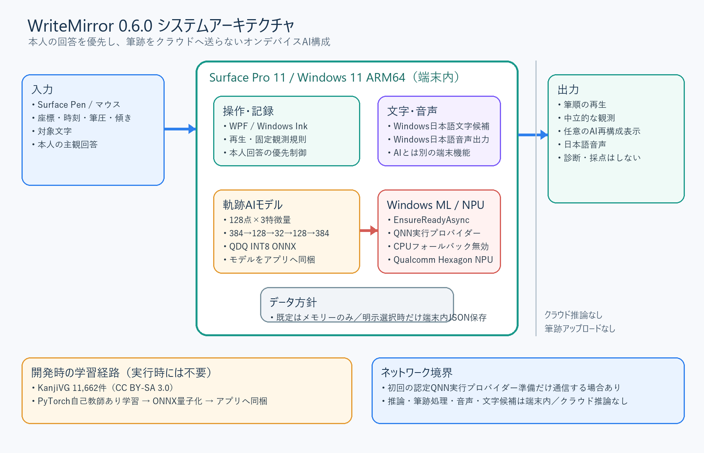

# WriteMirror

[License](LICENSE) · [Third-party notices](THIRD_PARTY_NOTICES.md) · [Contributing](CONTRIBUTING.md)

## English summary

WriteMirror is a privacy-first, on-device Japanese handwriting reflection research prototype for Windows 11 and Surface Pen. It combines WPF and Windows Ink with Windows ML, a quantized ONNX trajectory autoencoder, and Qualcomm QNN/Hexagon NPU inference. The software is deliberately non-diagnostic and consent-first: it does not score handwriting ability, infer disability or emotion, use cloud inference or analytics, require user accounts, or save handwriting by default.

Unless a file says otherwise, original source code, tests, scripts, and documentation authored for WriteMirror are licensed under Apache-2.0. KanjiVG-derived model and data artifacts remain under CC BY-SA 3.0. See [Third-Party Notices and License Scope](THIRD_PARTY_NOTICES.md).

WriteMirror は、Surface Pen の筆跡を本人が振り返るための日本語研究試作です。大学等の小グループ課題として、書字につまずきのある可能性を含む児童・小学校低学年を想定して設計しています。ただし、児童を研究参加者とする実験、診断、治療、学校・家庭への導入は本課題の範囲外です。期待される教育的効果は研究仮説であり、実証済みの効果ではありません。

## AI実装の現在地（0.6.0）

0.6.0では、P0修正済みWPF本体にWindows MLとQualcomm NPUを使うAI機能を統合しました。公開データKanjiVG 11,662件から自己教師あり学習した固定長軌跡オートエンコーダーを、静的形状のQDQ INT8 ONNXとしてアプリへ組み込んでいます。モデルは軌跡を再構成しますが、困難度、障害、能力、正しさ、感情を推論しません。

Surface Pro 11（Snapdragon X Elite）の実機では、Windows MLの `ExecutionProviderCatalog` が認定済みQNN実行プロバイダーを検出し、`EnsureReadyAsync` によるOS管理の取得、登録、モデルセッション生成、推論まで成功しました。0.6.0.4 ARM64 MSIXでCPUフォールバックを無効にし、20回のデモ筆跡推論を `QNNExecutionProvider / Qualcomm Hexagon NPU` で実行した結果は中央値1.524 ms、P95 5.400 msでした。モデルのSHA-256は `8F24114713A208753C5E088D50AC2A3D3980E71905BDF7C90F6BB76B68C2E9C3` です。

AI値は、位置を伴う本人回答が確定した後、または「特になし／うまくいった／答えない」の本人が「観測を見てみる」を明示選択した後だけ表示します。パッケージ版の自動操作確認では、中立回答の確定直後は推論0件、明示選択後に1件となることを確認しました。



プラットフォーム、AIモデル、データセット、外部ライブラリ、ライセンスの区別は [プラットフォーム・データ・ライセンス一覧](docs/WriteMirror_プラットフォーム・データ・ライセンス_ja.md)、コード量と実機値は [実装・性能指標](docs/WriteMirror_実装・性能指標_ja.md) に整理しています。

## グループメンバーの起動方法

1. [GitHub Releases](https://github.com/ye8527/WriteMirror/releases) から `WriteMirror_0.6.0_AI_NPU_ARM64.zip` をダウンロードします。
2. ZIPを端末内の通常フォルダーへすべて展開します。ZIP内から直接起動しないでください。
3. 展開先の `Install-WriteMirror.cmd` をダブルクリックします。
4. インストール後はスタートメニューの「WriteMirror」から起動します。初回はWindows MLが認定QNN実行プロバイダーを準備するため、インターネット接続と待ち時間が必要になる場合があります。

## デモ動画

GitHub Releasesの `WriteMirror_Demo_ja_0.6.0.mp4` は、0.6.0.4 ARM64 MSIXをSurface Pro 11で実際に操作した55秒の日本語字幕付き動画です。本人同意、保存しない独立練習、Windows日本語手書き認識、読み上げ、中立回答の尊重、明示選択後のHexagon NPU軌跡再構成を確認できます。

| 端末 | 対応状況 |
|---|---|
| Snapdragon X系のWindows 11 ARM64 Surface | ARM64 MSIXを使用。Surface Pro 11で導入、主要フロー、QNN NPUを確認済み |
| Intel／AMD搭載のWindows 11 Surface・PC | ARM64配布パッケージの対象外。x64ソースはビルド確認済みだが、別実機の最終操作確認は未実施 |
| Surface Pen／Windows Ink対応ペン | 推奨。ペンがない場合はマウス入力も可能 |

Windowsの日本語手書き認識機能がない環境でも、対象文字を手入力して筆跡の観測を続けられます。配布物は自己署名の公開証明書を現在ユーザーの`TrustedPeople`へ登録しますが、秘密鍵、パスワード、管理者のアカウント情報、利用者の個人情報を含みません。管理端末で承認またはブロックが表示された場合は、組織の方針に従ってください。

## 現在の位置づけ

| 対象 | 現在の判定 |
|---|---|
| 0.6.0 ARM64版 | 授業内で技術・操作を説明するための研究プロトタイプ |
| ひとりで練習 | 保存を禁止する独立操作モード。児童による有効性・無介助完遂を実証したものではない |
| 文字候補 | Windows 日本語手書き認識の候補。独自軌跡モデルとは別機能 |
| 0.6.0 ARM64 AI版 | Windows ML、量子化ONNX、Qualcomm QNN NPUをWPF/MSIXへ統合し実機検証済み |
| 児童評価 | 実施しない。児童は設計上の対象像であり、本課題の研究参加者ではない |
| 学校・家庭導入 | 実施しない。製品・医療機器・診断支援として提供しない |

## 現在の実装事実

- 現行の安定入力経路は `WriteMirror.Wpf` の WPF Windows Ink / ARM64 版
- 既定の「ひとりで練習」は、UI状態にかかわらず核心ポリシーがファイル保存を禁止
- 起動時の本人意思確認、5段階案内、説明・結果の音声、大型操作、途中終了を実装
- 原始的な時間・端末のペン先圧・差分値は「くわしい数値」へ折りたたみ、主画面では点数を表示しない
- Surface Pen / マウス筆跡、再生、画間空白時間、端末が取得したペン先圧の統計、主観範囲、2回の集計比較を実装
- 非接触 release 点を記録、距離、時間、速度、JSONから除外
- WPFの補間時刻から局所速度を推定せず、低速度・最遅区間候補を画面、照合、音声へ出さない
- 画間候補は未観測の空中経路を線で結ばず、前画終点と次画始点だけを示す
- 短い単一空白、長時間候補でない空白、有効移動区間が1件だけの場合は照合候補を出さない
- 2回差は5%以上かつ絶対差の暫定条件を満たす場合だけ「差が観測された」と表示し、良否を判定しない
- 2回目にも「ためらった」「書きにくかった」「気になった」「特になし」「うまくいった」「答えない」を表示
- 「特になし」「うまくいった」「答えない」は本人の回答を優先し、明示的に「観測を見てみる」を押すまで候補を表示しない
- 「いっしょに確認」だけ保存を選択可能。初期値OFFで、同意解除時は現在セッションを削除
- JSON は同一フォルダーの一時ファイルへ書き、完了後に置換。破損 JSON は利用不可として扱う
- 自己署名証明書を使う旧開発導入スクリプトは `LocalMachine\Root` ではなく `TrustedPeople` を使用
- 日本語手書き認識は、分離した Windows 文字候補ヘルパー。軌跡AIとは役割を分離
- 実行時フィードバックは端末内の固定日本語テンプレート。困難、改善、能力、感情、診断を推論しない
- Microsoftの移行案内に従い、8月1日版へPhi Silicaを追加しない。Aion Instructも本課題の実装範囲外
- KanjiVG / GRU は比較用の系列モデル実験として保持
- NPU版は固定長128点・3特徴量、384→128→32→128→384の自己教師ありオートエンコーダー
- Windows MLのQNN認定実行プロバイダーをOS管理で取得・登録し、Hexagon NPUを明示選択
- QNNセッションではCPUフォールバックを無効にし、NPUで全グラフが受理された場合だけNPU実行と表示
- NPU非搭載または準備失敗時はCPUモードと明示し、NPU実行とは表示しない

## 技術経路の判断

`WriteMirror.App` でWindows MLとQNN NPUの先行検証を行った後、AI経路を安定入力経路の `WriteMirror.Wpf` へ統合しました。0.6.0 ARM64 MSIXをSurface実機へインストールし、起動、QNN readiness、NPU確認推論、本人意思優先フロー、明示選択後のデモ筆跡推論を確認しています。

WPF版は実筆入力が安定していますが、筆画内時刻は WPF `InkCanvas` の点列へ補間しているため、区間速度を実測性能として発表しません。AIも補間局所速度を入力や根拠に使わず、座標と筆画終端だけを固定長化して扱います。本課題の実演にはWPF 0.6.0 ARM64 MSIXを使い、WinUI版はWindows MLの先行技術試作として残します。

## 起動

0.6.0の提出物はWindows 11 ARM64用MSIXです。ZIPを展開して`Install-WriteMirror.cmd`を実行し、以後はスタートメニューから起動します。インストール処理は署名と公開証明書の指紋を確認してから、現在ユーザーの`TrustedPeople`へ公開証明書を登録します。

```text
WriteMirror_0.6.0_AI_NPU_ARM64.zip
├─ Install-WriteMirror.cmd
├─ WriteMirror_0.6.0_ARM64.msix
├─ WriteMirror_公開証明書.cer
├─ 最初にお読みください_ja.md
├─ SHA256SUMS_ja.txt
└─ documents
```

日本語手書き認識機能を利用できない環境でも、対象文字の手入力と筆跡の観測は継続できます。文字候補を表示しても対象文字は自動確定せず、候補を明示的に選んだ場合だけ文字欄を置き換えます。詳しい導入と確認手順は配布ZIP内の`最初にお読みください_ja.md`を参照してください。

## 0.6.0 基本操作

1. 「点数をつけない」「独立練習では保存しない」「いつでもやめられる」を確認し、「つかう」または「いまはやめる」を本人が選びます。
2. 通常は「ひとりで練習（保存しない）」のまま使います。
3. 対象文字を自由入力するか、任意の Windows 文字候補から選びます。
4. Surface Pen で書き、気持ちを選びます。位置を伴う回答の場合だけ、気になった場所を囲みます。
5. 「特になし」「うまくいった」「答えない」では、観測候補を自動表示しません。「観測を見てみる」または「これで終わる」を本人が選びます。
6. 点数ではない振り返りを見て、本人が希望する場合だけ2回目を書きます。
7. 途中でやめる場合は「やめる・いまのデータを消す」を押します。

## 保存と削除

- 保存先: `%LOCALAPPDATA%\WriteMirror\Sessions`
- 独立練習: 保存禁止。処理中だけメモリーで保持
- 共同確認: 初期値OFF。本セッションで明示選択した時だけ端末内保存
- 共同確認の保持期限: 利用前に目的と期限を定め、期限時に削除
- 保存対象: 課題ID、利き手、時刻、接触中の筆画点、利用可能な筆圧・傾き、主観範囲
- 保存しないもの: 氏名、メール、学校、診断情報、自由形式ログ、生成プロンプト

## ビルドと検証

```powershell
dotnet build src\WriteMirror.Wpf\WriteMirror.Wpf.csproj -c Release -r win-arm64
dotnet test tests\WriteMirror.Core.Tests\WriteMirror.Core.Tests.csproj -c Release
```

2026年7月19日の0.6.0検証では、Core単体テスト66/66成功、WPF ARM64/x64、WinUI ARM64/x64の各Releaseビルドが警告0・エラー0でした。ARM64 MSIXをSurface実機へ導入し、起動、QNN NPU推論、Windows日本語手書き認識、本人回答優先フローを確認しました。修正後の画面操作では、「特になし」「うまくいった」「答えない」の3回答で自動候補0、位置要求0、再試行強制0を確認しました。本人が明示的に「観測を見てみる」を選んだ場合だけ画間候補とAI観測を処理し、「これで終わる」は通常終了になります。独立モードE2E前後で保存済みJSONは2件のままSHA-256も不変でした。

x64版は同じソースからビルドしました。ただし、現在のARM64実機では組織のアプリ制御によりx64 GUI本体が停止されたため、Intel / AMD搭載Surface実機での最終操作確認は未実施です。別のSurfaceでの動作を無条件に保証するものではありません。

## ソリューション構成

| プロジェクト | 役割 |
|---|---|
| `WriteMirror.Wpf` | 現行のWPF Windows Ink、本人意思優先UI、音声、Windows ML/QNN NPU軌跡AI |
| `WriteMirror.Core` | 接触点記録、観測値、比較、固定テンプレート |
| `WriteMirror.Infrastructure` | 原子的 JSON 保存、読込、個別削除、全削除 |
| `WriteMirror.Core.Tests` | P0境界条件を含む MSTest |
| `WriteMirror.App` | WinUI 3 / MSIXによるWindows ML readinessとQNN NPUの先行検証 |
| `experiments/japanese_trajectory` | KanjiVG前処理、GRU比較実験、NPU向け固定長モデルの学習・量子化 |

## 本課題で実施しない事項

- 児童を対象とする実験、データ収集、効果検証
- 診断、治療、能力評価、成績・学年・性別等の推論
- 学校・家庭への正式導入、運用保守、医療・福祉用途への提供
- Phi SilicaまたはAion Instructが動作しているという主張
- 軌跡AIの再構成差を、児童の困難、能力、正しさ、改善、教育効果へ読み替えること
- 公開データの学習結果を、児童の困難や教育効果の根拠として用いること

授業発表では、固定デモ、コードと単体テスト、公開資料に基づく研究計画の提示だけを行います。児童を対象とする実験、診断、能力評価または教育効果の主張は行いません。

## 免責事項

表示値は観測候補であり、困難、原因、正確さ、読みやすさ、能力、良否を示しません。WriteMirror は専門家の判断を代替しません。


## ライセンスとコントリビューション

- Feng YE が作成したコード、テスト、スクリプト、文書は、個別の表示がある場合を除き [Apache License 2.0](LICENSE) です。
- KanjiVG由来のONNXモデル、モデルカード、派生データは CC BY-SA 3.0 です。適用範囲、帰属、第三者依存関係は [THIRD_PARTY_NOTICES.md](THIRD_PARTY_NOTICES.md) を参照してください。
- バグ修正、テスト、アクセシビリティ、文書改善への参加方法は [CONTRIBUTING.md](CONTRIBUTING.md) を参照してください。児童の筆跡、個人情報、機密研究データを Issue、PR、テスト、外部AIサービスへ含めないでください。
